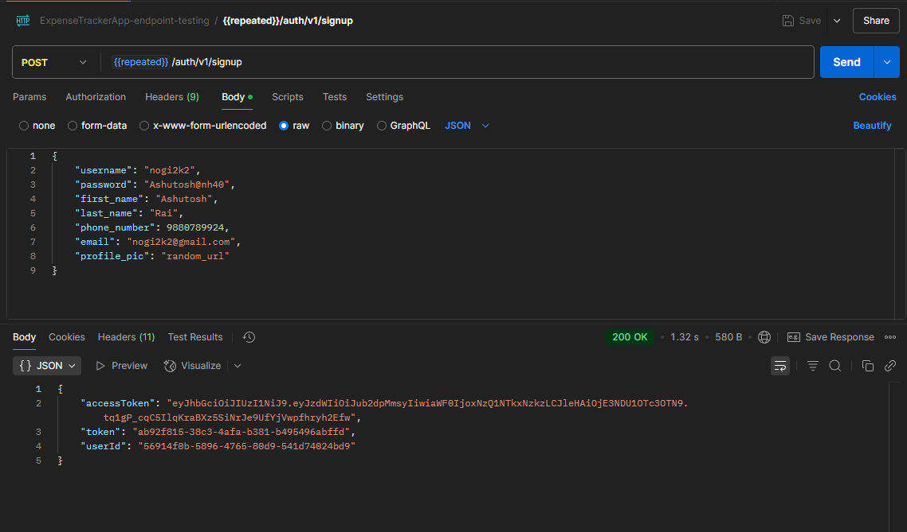
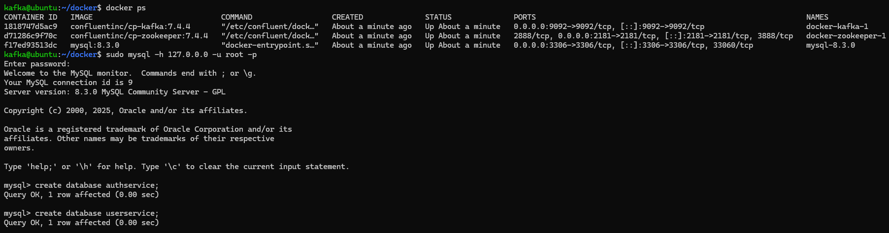
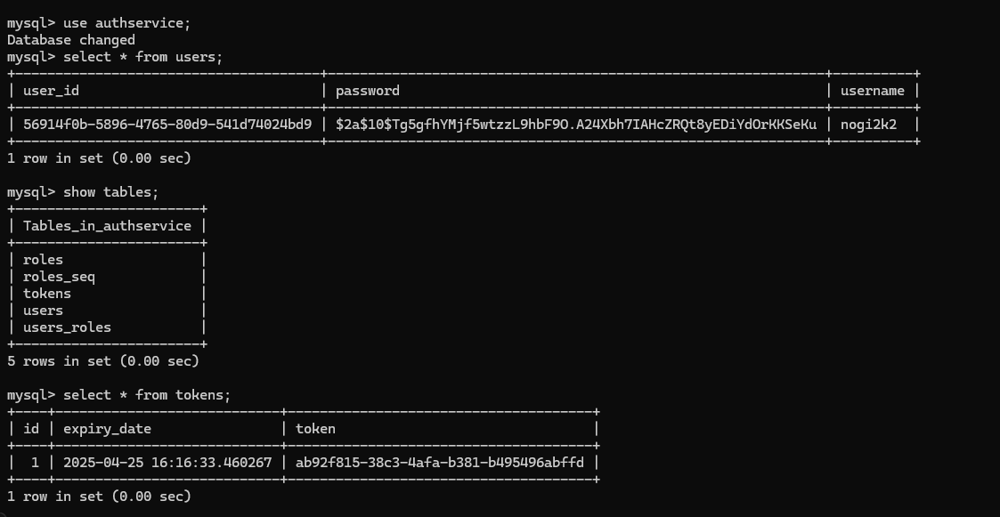
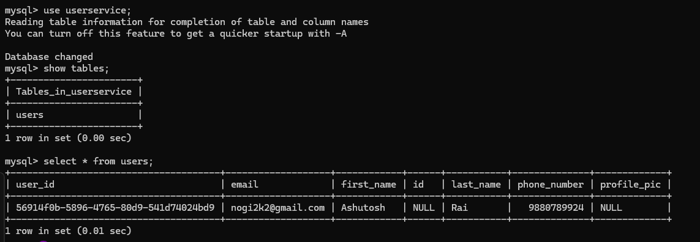

# Distributed Auth & User Service

A distributed authentication and user management system built with Spring Boot, Kafka, and MySQL, emphasizing stateless security, event-driven architecture, and modular service separation. This project demonstrates how secure authentication and scalable user operations can be orchestrated across services in a microservice ecosystem.

> ⚙️ **Note:** While this service functions independently, it has been designed to integrate seamlessly into a larger modular system — such as an expense tracker.

---

## 📋 Features

- 🔐 **Stateless Authentication:** A secure authentication system utilizing JWT tokens with Spring Security for stateless user sessions.
- 📈 **Scalable Event-Driven Design:** Kafka is used to decouple the authentication and user management services, enabling efficient communication via events.
- 🧩 **Microservices Architecture:** The system is built to be scalable, where different services (Auth and User) run independently and communicate asynchronously.
- 📊 **User Data Persistence:** Uses MySQL as the database for storing user credentials, and other user-related information. 
- 🧑‍💻 **Dockerized Environment:** The application is containerized using Docker, ensuring smooth deployment and portability across environments.

---

## Tech Stack

- **Java 22** – Core application logic, Spring Boot Framework
- **Spring Boot** – Backend framework for building the microservices
- **Spring Security & JWT** – GUI components and event-driven interface
- **MySQL** – Relational database to store user credentials and other data
- **Kafka** – Asynchronous communication between the microservices
- **Docker** – Containerizing the application for easy deployment
- **JPA / Hibernate** – ORM for interacting with the MySQL database
- **Gradle** - Build Automation
- **Git** – Version control 

---

## Project Structure

```
│── AuthService
|    │── app 
|    |    │── src
|    |    |   │── main/java/authservice
|    |    |   |         │── auth
|    |    |   |         |    │── JwtAuthFilter.java
|    |    |   |         |    │── UserConfig.java
|    |    |   |         │── controller
|    |    |   |         |    │── AuthController.java
|    |    |   |         |    │── SecurityConfig.java
|    |    |   |         |    │── TokenController.java
|    |    |   |         │── entities
|    |    |   |         |    │── RefreshToken.java
|    |    |   |         |    │── UserInfo.java
|    |    |   |         |    │── UserRole.java
|    |    |   |         │── eventProducer
|    |    |   |         |    │── UserInfoProducer.java
|    |    |   |         │── model
|    |    |   |         |    │── UserInfoDto.java
|    |    |   |         │── repository
|    |    |   |         |    │── RefreshTokenRepository.java
|    |    |   |         |    │── UserRepository.java
|    |    |   |         │── request
|    |    |   |         |    │── AuthRequestDTO.java
|    |    |   |         |    │── RefreshTokenRequestDTO.java
|    |    |   |         │── response
|    |    |   |         |    │── JwtResponseDTO.java
|    |    |   |         │── serialier
|    |    |   |         |    │── UserInfoSerializer.java
|    |    |   |         │── service
|    |    |   |         |    │── CustomUserDetails.java
|    |    |   |         |    │── JwtService.java
|    |    |   |         |    │── RefreshTokenService.java
|    |    |   |         |    │── UserDetailsServiceImpl.java

|    |    |   |         │── App.java
|    |    |   |── resources
|    |    |   |       |── application.properties


│── UserService
|    │── app 
|    |    │── src
|    |    |   │── main/java/com/microservice/userservice
|    |    |   |         │── config
|    |    |   |         |    │── UserServiceConfig.java
|    |    |   |         │── consumer
|    |    |   |         |    │── AuthServiceConsumer.java
|    |    |   |         |    │── UserController.java
|    |    |   |         │── deserializer
|    |    |   |         |    │── UserInfoDesrializer.java
|    |    |   |         │── entities
|    |    |   |         |    │── UserInfo.java
|    |    |   |         |    │── UserInfoDto.java
|    |    |   |         │── repository
|    |    |   |         |    │── UserRepository.java
|    |    |   |         │── service
|    |    |   |         |    │── UserService.java

|    |    |   |         │── UserserviceApplication.java
|    |    |   |── resources
|    |    |   |       |── application.properties

```

---

## 🧠 System Design & Workflow

This service follows a microservice-based architecture, designed to scale and integrate into larger systems like financial platforms or modular applications. It separates concerns between authentication and user profile management while enabling real-time communication via Kafka.

### 🔒 Authentication Service

- Handles stateless login/signup using JWT-based token authentication.

- Spring Security ensures role-based access control and session management.

- Credentials are securely stored using JPA with MySQL, and sensitive operations are handled through secure endpoints.


### 👤 User Service

- Operates independently but listens to Kafka events - user sign-up to maintain a decoupled flow.

- Stores and manages user-related data such as personal details.

- Provides APIs for accessing and updating user profile data.


### 📬 Inter-Service Communication

- Kafka acts as the communication backbone, allowing asynchronous event-based interaction between the services.

- This decoupling ensures scalability and maintainability while keeping services independent of each other.

---

## 📸 Visual Demo

### 📝 User Sign-Up Request via Postman
**A POST request sent from Postman to AuthService for user registration, receiving the authentication tokens (Access and Refresh Tokens) as a response.**

<p align="center">

</p>

### 🚀 Bringing up Containers and Setting up DB
**Initializing the docker containers for kafka, mysql and zookeeper services required by the microservices. And setting up the databases.**

<p align="center">

</p>

### 🔐 AuthService Database 
**CLI output for AuthService, demonstrating the database connection and storage of user credentials, roles and token upon successful registration.**

<p align="center">

</p>

### 👤 UserService Database 
**CLI output for UserService, showing the stored user data and system state after a registration request is processed.**

<p align="center">

</p>

---

## 📆 Getting Started

### 📁 Prerequisites

(Optional - Install all dependencies and run spring applications manually)
- **Java JDK 22**  
- **MySQL Server**
- **Docker**
- **Docker Compose**
- **Kafka**
- **Zookeeper**
- **Spring Boot**

(Use gradle to build and run project)
- **Gradle** 


---

### Docker compose setup for Kafka Zookeeper and mysql services

1. **Create the following docker-compose.yml file**  
   ```
    version: <docker_compose_version>
    services:
    zookeeper:
        image: confluentinc/cp-zookeeper:7.4.4
        environment:
        ZOOKEEPER_CLIENT_PORT: <port_zookeeper_client>
        ZOOKEEPER_TICK_TIME: 2000
        ports:
        - <port_mapping_zookeeper>

    kafka:
        image: confluentinc/cp-kafka:7.4.4
        depends_on:
        - zookeeper
        ports:
        - <port_mapping_kafka>
        environment:
        KAFKA_BROKER_ID: 1
        KAFKA_ZOOKEEPER_CONNECT: zookeeper:<port_zookeeper>
        KAFKA_ADVERTISED_LISTENERS: PLAINTEXT://<host_ip_addr>:<port_kafka>
        KAFKA_LISTENERS: PLAINTEXT://0.0.0.0:<port_kafka>         # Use 0.0.0.0 if not using docker network
        KAFKA_LISTENER_SECURITY_PROTOCOL_MAP: PLAINTEXT:PLAINTEXT,PLAINTEXT_HOST:PLAINTEXT
        KAFKA_INTER_BROKER_LISTENER_NAME: PLAINTEXT
        KAFKA_OFFSETS_TOPIC_REPLICATION_FACTOR: 1
        KAFKA_AUTO_CREATE_TOPICS_ENABLE: "true"  # Auto-creates topic when Spring tries to publish

    mysql:
        image: mysql:8.3.0
        container_name: mysql-8.3.0
        restart: always
        environment:
        MYSQL_USER: test
        MYSQL_ROOT_USER: root
        MYSQL_PASSWORD: 'password'
        MYSQL_ROOT_PASSWORD: 'password'
        ports:
        - <port_mapping_mysql>
        expose:
        - <expose port for mysql>
        volumes:
        - mysql-db:/var/lib/mysql       # Persists data everytime container is stopped or downed

    volumes:
    mysql-db:
        driver: local
    ```
   
2. **Use Docker Compose to bring up the containers**
    ```
        docker compose -f <yml for docker compose> up -d    # -d flag is for daemon mode (background process)
    ```

3. **Login to mysql and setup the databases**
    ```
        sudo mysql -h <local_host> -u root -p   # Authenticate root user with password
    ```
- Setup the databases
    ```
        create database authservice
        create database userservice
    ```

**Note** - Set the DB config, credentials and kafka configs in *application.properties** for both the microservices.

---

###  🚀 Clone and Run

1. **Clone the repository**
```
    $ git clone https://github.com/nogi2k2/Whispr.git
```

2. **Navigate into the project directory**
```
    $ cd <AuthService> 
    $ cd <UserService> 
```

3. **Build and Run the Spring Applications using gradlew.bat**
- Windows
    ```
        $ gradlew.bat build 
        $ gradlew.bat run 
    ```
- Unix 
    ```
        $ ./gradlew build 
        $ ./gradlew run 
    ```
---