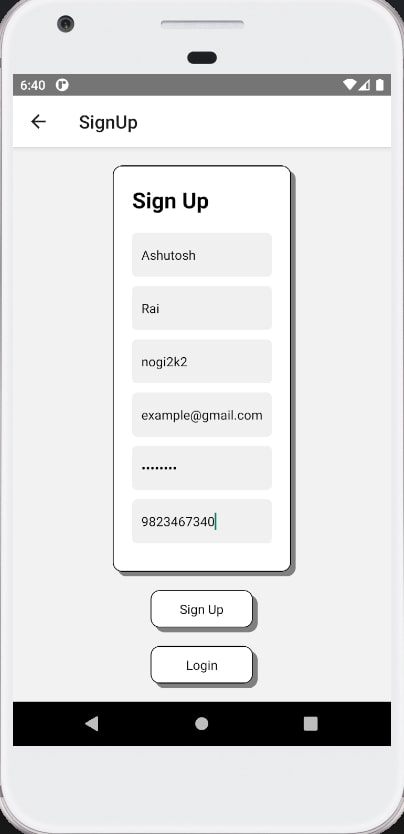
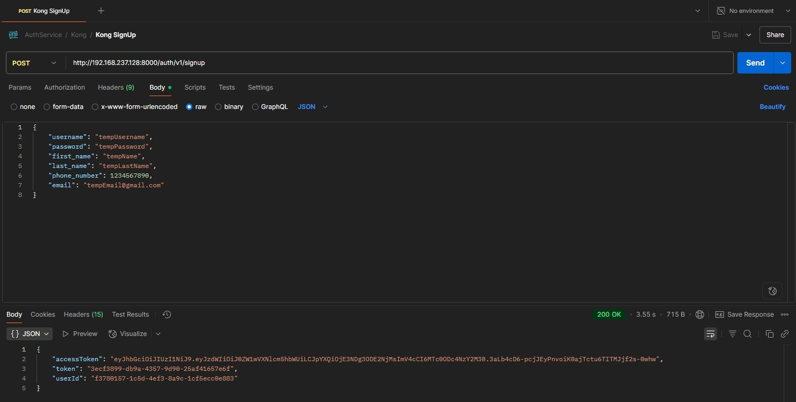
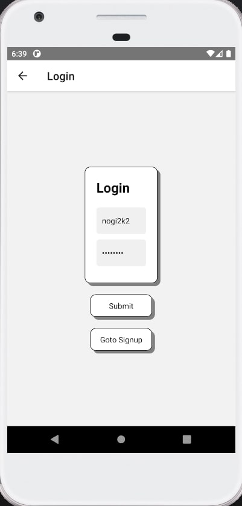
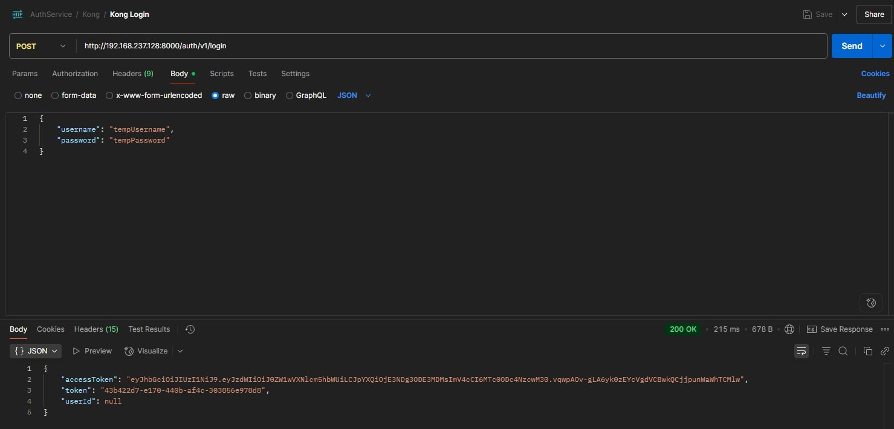

# Expense Tracker App

A production-ready, distributed **Expense Tracking** ecosystem built from the ground up using a microservices based architecture. This platform demonstrates enterprise-level software engineering practices, featuring **Kong API Gateway** with custom authentication plugins, **React Native** based android mobile application, **LLM**-powered SMS parsing, robust **cloud infrastructure**, and fully automated **CI/CD** pipelines. The system is designed to handle real-world scale with security, performance, and maintainability as foundational principles.

> ⚙️ **Note:** While these services function independently, they have been designed to integrate seamlessly into a larger modular system — an Expense Tracker.

---

## Feature Overview

- **Stateless JWT Authentication:** Implements industry-standard JSON Web Tokens with RS256 signing algorithm for secure, scalable authentication across distributed services.
- **Refresh Token Rotation:** Refresh tokens are replaced when they expire. This keeps user sessions secure while avoiding unnecessary token churn, offering a balance between security and efficiency.
- **Custom Lua Authentication Plugin:** Gateway plugin written in Lua that acts as a centralized authentication checkpoint for all unprotected endpoint requests.
- **Multi-layered Security:** Gateway-level JWT token validation is enforced for all unprotected requests. Role-based authorization and database-level access controls are configured for future use but are not currently active.
- **Spring Security Integration:** Integrated with Spring Security, enabling future support for method-level security and role-based access (via GrantedAuthority), though not actively used yet.
- **Scalable Event-Driven Design:** Kafka decouples the authentication, user management, and expense-ds services, supporting efficient asynchronous communication.
- **Microservices Architecture:** Scalable system where services (Auth, User, Expense, Data Science) run independently and manage their own schema, ensuring clear separation of concerns.
- **Expense Management:** Dedicated Ledger Service to Add, Update, Delete, View, and Categorize expenses.
- **User Data Persistence:** MySQL used for persisting user credentials, profiles, and related data.
- **Dockerized Environment:** Services are containerized with Docker for consistent deployment across environments.
- **Cloud-Native Infrastructure:** Multi-AZ AWS setup managed via CloudFormation with CI/CD automation using GitHub Actions. CDK migration in progress. Includes VPC with public/private subnets, Internet/NAT Gateways, route tables, ALB (with listener & SG), dummy target group, ECS cluster, and container security groups.
- **React Native Android App:** Built with React Native and TypeScript, designed for cross-platform support (currently Android). Features secure login/signup with validation and JWT/refresh token caching via AsyncStorage. Home and profile screens are in progress.
---

## Tech Stack

- **Java 22** – Core backend logic
- **TypeScript** – AWS CDK scripts and React Native Android app  
- **Lua** – Custom Kong gateway plugin for authentication   
- **React Native** – Frontend mobile application (Android)  
- **MySQL** – RDB for persisting user credentials and expense ledger data
- **Kafka** – Asynchronous communication 
- **Docker & Docker Compose** – Containerization and local orchestration 
- **AWS CloudFormation** – Infrastructure provisioning (CDK migration in progress)  
- **GitHub Actions** – CI/CD automation for builds, tests, and infrastructure deployment  
- **Linux** – Environment for testing and initial deployment on a VM  
- **Postman** – API testing and debugging 
- **Git** – Version control system 

---

## Project Structure

```
│── AuthService
|    │── app 
|    |    │── src
|    |    |   │── main/java/authservice
|    |    |   |         │── auth
|    |    |   |         |    │── JwtAuthFilter.java
|    |    |   |         |    │── UserConfig.java
|    |    |   |         │── controller
|    |    |   |         |    │── AuthController.java
|    |    |   |         |    │── SecurityConfig.java
|    |    |   |         |    │── TokenController.java
|    |    |   |         │── entities
|    |    |   |         |    │── RefreshToken.java
|    |    |   |         |    │── UserInfo.java
|    |    |   |         |    │── UserRole.java
|    |    |   |         │── eventProducer
|    |    |   |         |    │── UserInfoProducer.java
|    |    |   |         │── model
|    |    |   |         |    │── UserInfoDto.java
|    |    |   |         │── repository
|    |    |   |         |    │── RefreshTokenRepository.java
|    |    |   |         |    │── UserRepository.java
|    |    |   |         │── request
|    |    |   |         |    │── AuthRequestDTO.java
|    |    |   |         |    │── RefreshTokenRequestDTO.java
|    |    |   |         │── response
|    |    |   |         |    │── JwtResponseDTO.java
|    |    |   |         │── serialier
|    |    |   |         |    │── UserInfoSerializer.java
|    |    |   |         │── service
|    |    |   |         |    │── CustomUserDetails.java
|    |    |   |         |    │── JwtService.java
|    |    |   |         |    │── RefreshTokenService.java
|    |    |   |         |    │── UserDetailsServiceImpl.java

|    |    |   |         │── App.java
|    |    |   |── resources
|    |    |   |       |── application.properties


│── UserService
|    │── app 
|    |    │── src
|    |    |   │── main/java/com/microservice/userservice
|    |    |   |         │── config
|    |    |   |         |    │── UserServiceConfig.java
|    |    |   |         │── consumer
|    |    |   |         |    │── AuthServiceConsumer.java
|    |    |   |         |    │── UserController.java
|    |    |   |         │── deserializer
|    |    |   |         |    │── UserInfoDesrializer.java
|    |    |   |         │── entities
|    |    |   |         |    │── UserInfo.java
|    |    |   |         |    │── UserInfoDto.java
|    |    |   |         │── repository
|    |    |   |         |    │── UserRepository.java
|    |    |   |         │── service
|    |    |   |         |    │── UserService.java

|    |    |   |         │── UserserviceApplication.java
|    |    |   |── resources
|    |    |   |       |── application.properties

│── ExpenseService
|    │── app 
|    |    │── src
|    |    |   │── main/java/com/service
|    |    |   |         │── consumer
|    |    |   |         |    │── ExpenseConsumer.java
|    |    |   |         |    │── ExpenseDeserializer.java
|    |    |   |         │── controller
|    |    |   |         |    │── ExpenseController.java
|    |    |   |         │── dto
|    |    |   |         |    │── ExpenseDto.java
|    |    |   |         │── entities
|    |    |   |         |    │── Expense.java
|    |    |   |         │── repository
|    |    |   |         |    │── ExpenseRepository.java
|    |    |   |         │── service
|    |    |   |         |    │── ExpenseService.java

|    |    |   |         │── ServiceApplication.java
|    |    |   |── resources
|    |    |   |       |── application.properties

│── DsService
|    │── setup.py
|    │── src 
|    |    │── app
|    |    |   │── service
|    |    |   |     │── Expense.py
|    |    |   |     │── llmService.py
|    |    |   |     │── messageService.py
|    |    |   │── utils
|    |    |   |     │── __init__.py
|    |    |   |     │── messageUtils.py
|    |    |   │── __init__.py
|    |    |   │── config.py 

│── react-android
|    │── src/app
|    |    │── components
|    |    |   │── CustomBox.tsx
|    |    |   │── CustomText.tsx
|    |    │── pages
|    |    |   │── Home.tsx
|    |    |   │── Login.tsx
|    |    |   │── SignUp.tsx
|    |    │── App.tsx

│── expense-tracker-deps
|    │── .github/workflow
|    |    |   │── deploy-infrastructure.yml
|    │── config 
|    |    |   │── kong.yml
|    │── custom-plugins/custom-auth
|    |    |   │── handler.lua
|    |    |   │── schema.lua
|    │── jars
|    |    |   │── pygz
|    |    |   |     │── Dockerfile
|    |    |   |     │── ds-service-1.0.tar.gz
|    |    |   │── Dockerfile
|    |    |   │── authservice.jar
|    |    |   │── expenseservice.jar
|    |    |   │── userservice.jar
|    │── cloudformation-infra.yaml 
|    │── kong.yml
|    │── services.yml  
```

---

## System Design 

The Expense Tracker App adopts a modular, microservices-based architecture featuring event-driven workflows and cloud-native deployment practices. Each service is independently deployable and communicates asynchronously through Apache Kafka. External access is managed via a Kong API Gateway. While development was carried out on a Windows environment, the system was tested and initially deployed on a Linux virtual machine.

### React Native Frontend

- Cross-platform mobile app built with React Native (Android/iOS)

- Secure token storage using React AsyncStorage for JWT access and refresh tokens

- Communicates with backend through HTTP via Kong Gateway


### Kong API Gateway

- Acts as a reverse proxy between the frontend and backend service endpoints

- Custom Lua plugin handles JWT validation and user security context injection

- Ensures secure, authenticated routing to internal microservices


### Authentication Service

- Stateless login/signup flow using JWT and refresh tokens

- Spring Security enforces role-based access control

- Token generation and validation are fully decoupled through Kong’s gateway and Lua plugin

- Credentials are securely persisted using JPA/Hibernate with MySQL


### User Service

- Stores and manages user profile metadata

- Consumes Kafka events (User SignUp) for eventual consistency and decoupling

- Provides REST APIs for profile updates and account metadata access


### Expense Service

- Handles expense CRUD operations linked to user identity

- Each record includes: amount, currency, merchant, timestamp

- Listens to structured Kafka events from the DS Service for automatic SMS parsing and expense insertion


### Data Science Service

- Processes raw SMS messages using LangChain and Mistral LLM api to extract structured data

- Extracted fields: amount, currency, merchant (schema-enforced)

- Publishes structured events to Kafka for downstream processing by the Expense Service

- Enables hands-free expense tracking from SMS messages


### Asynchronous Event-Driven Communication

- Apache Kafka acts as the central event bus for the system

- Services publish and consume events for workflows like sign-up and SMS parsing

- Ensures secure, durable, and ordered inter-service messaging with eventual consistency


### AWS Cloud Deployment

- Infrastructure provisioning managed via AWS CDK/CF templates.

- CI/CD automation powered by GitHub Actions 

- Microservices deployed as containers 

## Workflow 
```
        ┌─────────────────────────────────────────────────────────────────────────────┐
        │                        Client Application Layer                             │
        ├─────────────────────────────────────────────────────────────────────────────┤
        │  React Native Mobile App (Android)         │    Web Dashboard (Planned)     │
        │  ├─ Authentication UI Components           │    ├─ User Info Panel          │
        │  ├─ Secure Token Storage (AsyncStorage)    │    ├─ Analytics Dashboard      │
        └─────────────────────────────────────────────────────────────────────────────┘
                                                │
                                                ▼ HTTP
                            ┌──────────────────────────────────────────┐
                            │         API Gateway Layer (Kong)         │
                            ├──────────────────────────────────────────┤
                            │        Custom Lua Auth Plugin            │
                            │        ├─ JWT Token Validation           │
                            │        ├─ Security Context Injection     │
                            │        └─ User ID Header Propagation     │
                            └──────────────────────────────────────────┘
                                                │
                                                ▼ VPC
            ┌──────────────────────────────────────────────────────────────────────────┐
            │                            Microservices Layer                           │
            ├──────────────────────────────────────────────────────────────────────────┤
            │ ┌─────────────┐ ┌─────────────┐ ┌─────────────┐ ┌──────────────────────┐ │
            │ │Auth Service │ │User Service │ │Expense Serv │ │DS Service            │ │
            │ │             │ │             │ │             │ │                      │ │
            │ │JWT/Refresh  │ │Profile Mgmt │ │Ledger       │ │LLM SMS Parsing       │ │
            │ │Token Mgmt   │ │Kafka Events │ │Categories   │ │LangChain Integration │ │
            │ │Kafka Event  │ │MySQL Persist│ │Analytics    │ │Kafka Event           │ │
            │ │Publishing   │ └─────────────┘ └─────────────┘ └──────────────────────┘ │ 
            | └─────────────┘                                                          |
            └──────────────────────────────────────────────────────────────────────────┘
                                                │
                                                ▼ Kafka 
                                ┌───────────────────────────────┐
                                │     Event Streaming Layer     │
                                ├───────────────────────────────┤
                                │  Apache Kafka                 │
                                │  ├─ User Registration Events  │
                                │  ├─ SMS Processing Events     │
                                └───────────────────────────────┘
                                                │
                                                ▼ JDBC
                            ┌───────────────────────────────────────────┐
                            │          Data Persistence Layer           │
                            ├───────────────────────────────────────────┤
                            │ ┌───────────┐ ┌─────────┐ ┌─────────────┐ │
                            │ │Auth DB    │ │User DB  │ │Expense DB   │ │
                            │ │           │ │         │ │             │ │
                            │ │User Creds │ │Profile  │ │Transactions │ │
                            │ │JWT Tokens │ │Metadata │ │Merchants    │ │
                            | └───────────┘ └─────────┘ └─────────────┘ │
                            └───────────────────────────────────────────┘
```

---

## 📸 Visual Demo

### 🚀 Bringing up Containers and Setting up DB
**Initializing the docker containers for kafka, mysql, zookeeper services and backend microservices required by the application, and setting up the databases.**

<p align="center">

</p>

### 📱 Mobile Signup Page
**React Native TypeScript signup page with user registration form and validation.**

<p align="center">

</p>

### 📝 User Sign-Up Request 
**A POST request sent from Postman to Kong for user registration, receiving the authentication tokens (Access and Refresh Tokens) as a response.**

<p align="center">

</p>

### 🗃️ AuthService Database
**MySQL table view for AuthService, showing stored user credentials and token entries post-registration.**

<p align="center">

</p>

### 🗃️ UserService Database
**MySQL table view for UserService, displaying user meta data stored independently from the authentication layer.**

<p align="center">

</p>

### 📱 Mobile Login Page
**React Native TypeScript login page providing a clean, native mobile experience for user authentication.**

<p align="center">

</p>

### 🔐 User Login Request
**A POST request to Kong to authenticate a user. On valid credentials, the service returns new JWT and refresh tokens.**

<p align="center">

</p>

<!-- ### 👤 Fetch User Profile 
**A POST request to UserService for fetching user metadata. The service processes the json payload attached to the request and retrievs the corresponding user's profile data from the database.**

<p align="center">

</p> -->

### 💬 SMS Parsing through DS-Service (Without Kong)
**A POST request to Ds-Service simulating a bank SMS. Redirected to the DS-Service, the service uses an LLM to parse the message and responds with structured expense data in JSON format.**

<p align="center">

</p>

### 🧾 ExpenseService Database (Without Kong)
**MySQL table view for ExpenseService showing a parsed bank SMS entry that was published by the Data Science Service and persisted as a user expense.**

<p align="center">

</p>

---

## 📆 Getting Started

1. **Start Containers for Kafka, MySQL, Zookeeper, Microservices, and Kong using the expense-tracker-deps/services.yml and expense-tracker-deps/kong.yml (These services depend on the config/ and custom-plugins/ directories for correct Kong and plugin setup)**  
    ```
    docker compose -f expense-tracker-deps/kong.yml up -d
    docker compose -f expense-tracker-deps/services.yml up -d
    ```
> ⚙️ **Note:**  
            - Pull the prebuilt docker images from Docker Hub:

                    • nogi2k2/expense-tracker-services:auth-service
                    • nogi2k2/expense-tracker-services:user-service
                    • nogi2k2/expense-tracker-services:expense-service
                    • nogi2k2/expense-tracker-services:ds-service

>   Or reference them directly in your Docker Compose configuration

2. **Verify Container Status:**
    ```
        docker ps
    ```

3. **Access the MySQL Container**
    ```
    docker exec -it <mysql_container_id> mysql -u root -p
    ```

4. **Initialize Required Databases**
    ```
    CREATE DATABASE authservice;
    CREATE DATABASE userservice;
    CREATE DATABASE expenseservice;
    CREATE DATABASE dsservice;

5. **Set Up and Run the React Native App**
    ```
    npm install -g yarn     # Install yarn globally

    # Install the dependencies using package.json from root
    yarn install            # Recommended – resolves versioning conflicts
        (or)
    npm install             # Alternative

    # Make sure an AVD (Android Virtual Device) is installed and running or a device is connected (Android Studio)
    npx react-native run-android
    # This starts the Metro bundler automatically in the default terminal - choose (a) for android
    ```
    
---
