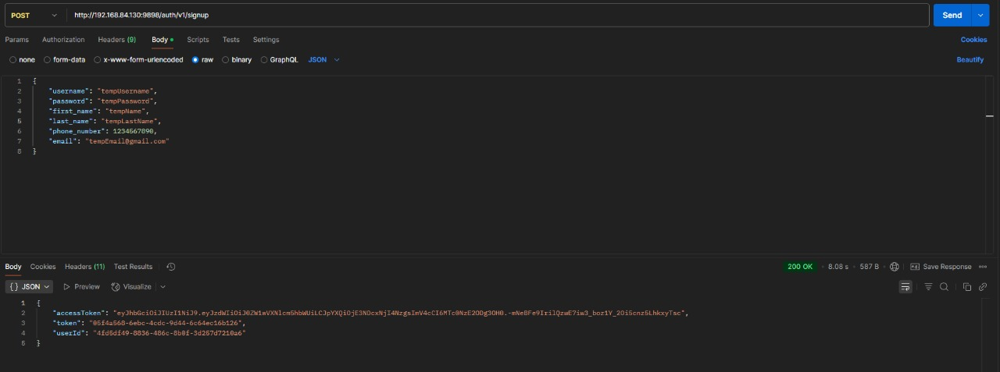
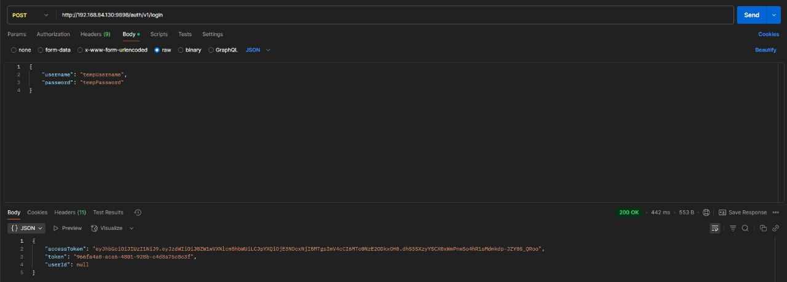
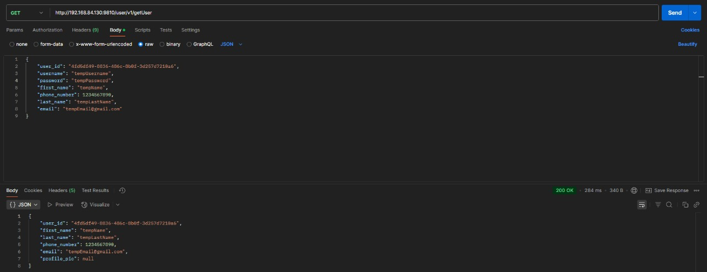
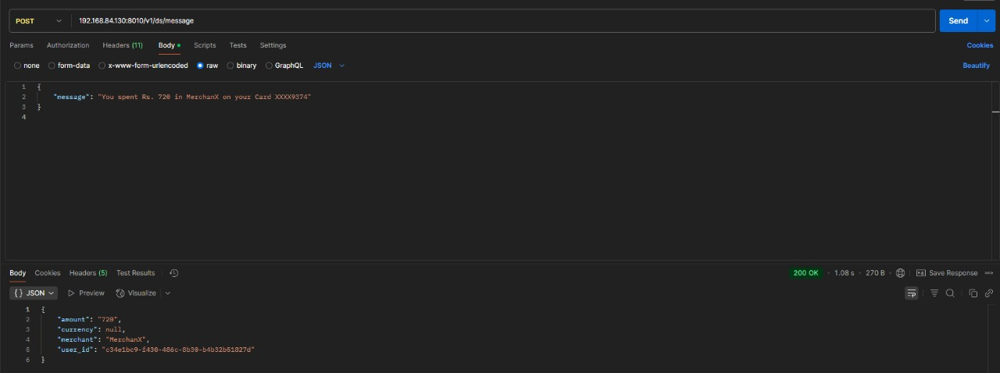
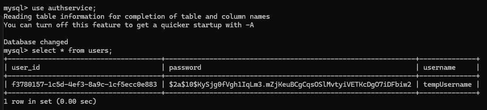
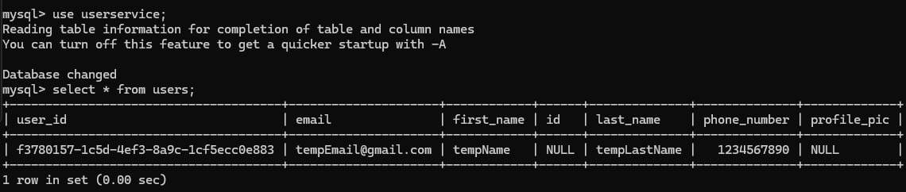
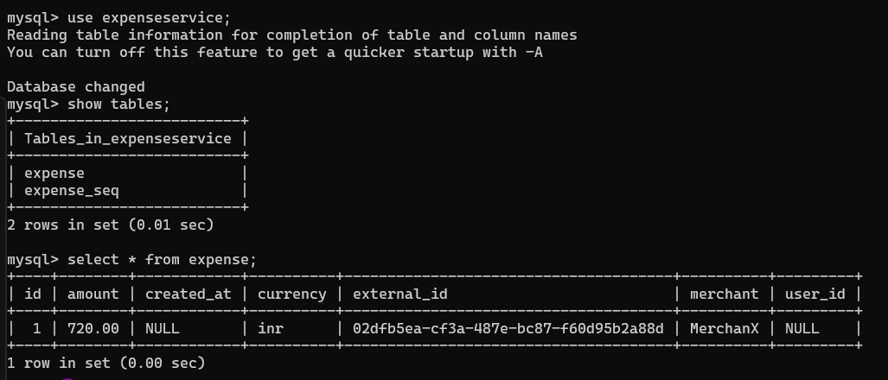
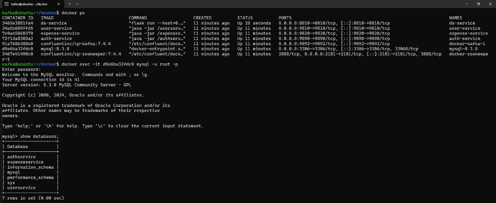

# Expense Tracker App

A distributed, microservices-based **Expense Tracker** built using **Spring Boot**, **Kafka**, **MySQL**, and **Docker**, designed to scale securely and operate efficiently. The system is modular, featuring stateless authentication, event-driven communication, and a containerized deployment workflow — enabling users to track expenses and manage profiles in a decoupled yet cohesive setup.

> ⚙️ **Note:** While these services function independently, they have been designed to integrate seamlessly into a larger modular system — an Expense Tracker.

---

## 📋 Features

- 🔐 **Stateless Authentication:** A secure authentication system utilizing JWT tokens with Spring Security for stateless user sessions, also includes refresh token support.
- 📈 **Scalable Event-Driven Design:** Kafka is used to decouple the authentication and user management services, enabling efficient communication via events.
- 🧩 **Microservices Architecture:** The system is built to be scalable, where different services (Auth, User, Expense and Data Science) run independently and communicate asynchronously. Each service manages its own schema, ensuring seperation of concerns.
- 📊 **User Data Persistence:** Uses MySQL to persist user credentials and profile information, and other user-related information. 
- 💸 **Expense Management:** A dedicated Ledger Service that allows users to Add, Update, Delete, View and Categorize Expenses.
- 🧑‍💻 **Dockerized Environment:** The application is containerized using Docker, ensuring smooth deployment and portability across environments.

---

## Tech Stack

- **Java 22** – Core application logic, Spring Boot Framework
- **Spring Boot** – Backend framework for building the microservices
- **Spring Security & JWT** – GUI components and event-driven interface
- **MySQL** – Relational database to store user credentials and other data
- **Kafka** – Asynchronous communication between the microservices
- **Docker & Docker Compose** – Containerization and orchestration of all microservices for local and production environments
- **JPA / Hibernate** – ORM for interacting with the MySQL database
- **Gradle** - Build automation and dependency management
- **Postman** – API testing with organized collections for each service
- **Git** – Version control for collaborative development

---

## Project Structure

```
│── AuthService
|    │── app 
|    |    │── src
|    |    |   │── main/java/authservice
|    |    |   |         │── auth
|    |    |   |         |    │── JwtAuthFilter.java
|    |    |   |         |    │── UserConfig.java
|    |    |   |         │── controller
|    |    |   |         |    │── AuthController.java
|    |    |   |         |    │── SecurityConfig.java
|    |    |   |         |    │── TokenController.java
|    |    |   |         │── entities
|    |    |   |         |    │── RefreshToken.java
|    |    |   |         |    │── UserInfo.java
|    |    |   |         |    │── UserRole.java
|    |    |   |         │── eventProducer
|    |    |   |         |    │── UserInfoProducer.java
|    |    |   |         │── model
|    |    |   |         |    │── UserInfoDto.java
|    |    |   |         │── repository
|    |    |   |         |    │── RefreshTokenRepository.java
|    |    |   |         |    │── UserRepository.java
|    |    |   |         │── request
|    |    |   |         |    │── AuthRequestDTO.java
|    |    |   |         |    │── RefreshTokenRequestDTO.java
|    |    |   |         │── response
|    |    |   |         |    │── JwtResponseDTO.java
|    |    |   |         │── serialier
|    |    |   |         |    │── UserInfoSerializer.java
|    |    |   |         │── service
|    |    |   |         |    │── CustomUserDetails.java
|    |    |   |         |    │── JwtService.java
|    |    |   |         |    │── RefreshTokenService.java
|    |    |   |         |    │── UserDetailsServiceImpl.java

|    |    |   |         │── App.java
|    |    |   |── resources
|    |    |   |       |── application.properties


│── UserService
|    │── app 
|    |    │── src
|    |    |   │── main/java/com/microservice/userservice
|    |    |   |         │── config
|    |    |   |         |    │── UserServiceConfig.java
|    |    |   |         │── consumer
|    |    |   |         |    │── AuthServiceConsumer.java
|    |    |   |         |    │── UserController.java
|    |    |   |         │── deserializer
|    |    |   |         |    │── UserInfoDesrializer.java
|    |    |   |         │── entities
|    |    |   |         |    │── UserInfo.java
|    |    |   |         |    │── UserInfoDto.java
|    |    |   |         │── repository
|    |    |   |         |    │── UserRepository.java
|    |    |   |         │── service
|    |    |   |         |    │── UserService.java

|    |    |   |         │── UserserviceApplication.java
|    |    |   |── resources
|    |    |   |       |── application.properties

│── ExpenseService
|    │── app 
|    |    │── src
|    |    |   │── main/java/com/service
|    |    |   |         │── consumer
|    |    |   |         |    │── ExpenseConsumer.java
|    |    |   |         |    │── ExpenseDeserializer.java
|    |    |   |         │── controller
|    |    |   |         |    │── ExpenseController.java
|    |    |   |         │── dto
|    |    |   |         |    │── ExpenseDto.java
|    |    |   |         │── entities
|    |    |   |         |    │── Expense.java
|    |    |   |         │── repository
|    |    |   |         |    │── ExpenseRepository.java
|    |    |   |         │── service
|    |    |   |         |    │── ExpenseService.java

|    |    |   |         │── ServiceApplication.java
|    |    |   |── resources
|    |    |   |       |── application.properties

│── DsService
|    │── setup.py
|    │── src 
|    |    │── app
|    |    |   │── service
|    |    |   |     │── Expense.py
|    |    |   |     │── llmService.py
|    |    |   |     │── messageService.py
|    |    |   │── utils
|    |    |   |     │── __init__.py
|    |    |   |     │── messageUtils.py
|    |    |   │── __init__.py
|    |    |   │── config.py 

```

---

## 🧠 System Design & Workflow

This service follows a microservice-based architecture, designed to scale and integrate into larger systems like financial platforms or modular applications. It separates concerns between authentication and user profile management while enabling real-time communication via Kafka.

### 🔒 Authentication Service

- Handles stateless login/signup using JWT-based token authentication.

- Spring Security ensures role-based access control and session management.

- Credentials are securely stored using JPA with MySQL, and sensitive operations are handled through secure endpoints.


### 👤 User Service

- Operates independently but listens to Kafka events - user sign-up to maintain a decoupled flow.

- Stores and manages user-related data such as personal details.

- Provides APIs for accessing and updating user profile data.


### 💸 Expense Service

- Manages creation, retrieval, and deletion of individual user expenses.

- Each expense is associated with a user and includes metadata like amount, merchant, and currency.

- Listens to Kafka events published by the Data Science Service containing structured expense data extracted from bank SMS messages.

- Upon receiving an event, the service validates and persists the parsed expense into the user's financial ledger.


### 🧠 Data Science Service

- Parses unstructured bank SMS messages into structured expense data using a Large Language Model (LLM).

- Utilizes LangChain to interface with the LLM and enforce a predefined output schema (amount, merchant, currency) for consistent downstream processing.

- After extracting the relevant fields, publishes the structured data as an event to Kafka.

- These events are consumed by the Expense Service to create persistent records in the expense ledger.


### 📬 Inter-Service Communication

- Kafka acts as the communication backbone, allowing asynchronous event-based interaction between the services.

- This decoupling ensures scalability and maintainability while keeping services independent of each other.

---

## 📸 Visual Demo

### 📝 User Sign-Up Request via Postman
**A POST request sent from Postman to AuthService for user registration, receiving the authentication tokens (Access and Refresh Tokens) as a response.**

<p align="center">

</p>

### 🔐 User Login Request via Postman
**A POST request to the AuthService to authenticate a user. On valid credentials, the service returns new JWT and refresh tokens.**

<p align="center">

</p>

### 👤 Fetch User Profile (getUser API)
**A POST request to the UserService with raw JSON containing user details. The service processes this payload to retrieve the corresponding user profile from the database.**

<p align="center">

</p>

### 💬 Sending a Bank SMS for Parsing
**A POST request to the Data Science Service simulating a bank SMS. The service uses an LLM to parse the message and responds with structured expense data in JSON format.**

<p align="center">

</p>

### 🗃️ AuthService Database
**MySQL table view for AuthService, showing stored user credentials and token entries post-registration.**

<p align="center">

</p>

### 🗃️ UserService Database
**MySQL table view for UserService, displaying user meta data stored independently from the authentication layer.**

<p align="center">

</p>

### 🧾 ExpenseService Database
**MySQL table view for ExpenseService showing a parsed bank SMS entry that was published by the Data Science Service and persisted as a user expense.**

<p align="center">

</p>

### 🚀 Bringing up Containers and Setting up DB
**Initializing the docker containers for kafka, mysql and zookeeper services required by the microservices. And setting up the databases.**

<p align="center">

</p>

---

## 📆 Getting Started

### 🐳 Spin Up All Services with Docker Compose

1. **Use the provided docker-compose.yml file to bring up all required services (Kafka, Zookeeper, MySQL)**  
    ```
    docker compose -f docker-compose.yml up -d
    ```
   
2. **Confirm all containers are running:**
    ```
        docker ps
    ```

3. **Get the container ID for the MySQL container and access it**
    ```
    docker exec -it <mysql_container_id> mysql -u root -p
    ```

4. **Inside the MySQL prompt, create the following databases**
    ```
    CREATE DATABASE authservice;
    CREATE DATABASE userservice;
    CREATE DATABASE expenseservice;
    CREATE DATABASE dsservice;
    ```
    
---
